# Entity-Relationship Diagram

Full schema, generated from `../migrations/`. Types are simplified for
Mermaid's ER syntax (no precision/scale, no parentheses); see the migration
files for exact `NUMERIC(p,s)` / `CHECK` definitions. `PK`/`FK`/`UK` markers
follow standard ER notation; `FK*` marks a **polymorphic** reference that
Postgres cannot express as a real foreign key — those are validated by
trigger instead (see `docs/RELATIONSHIPS.md` and `0012_triggers.sql`).

```mermaid
erDiagram
    %% ============================ Lookup tables ============================
    DEPARTMENTS { uuid id PK
        text name UK }
    LOCATIONS { uuid id PK
        text name UK }
    WAREHOUSE_LOCATIONS { uuid id PK
        text name UK }
    ITEM_CATEGORIES { uuid id PK
        text name UK }
    UOMS { text code PK
        text name }
    JOB_TITLES { uuid id PK
        text title UK }
    PRODUCTION_LINES { uuid id PK
        text name UK }
    SHIFTS { uuid id PK
        text name UK }
    WATER_SOURCES { uuid id PK
        text code UK }
    TREATMENT_STAGES { uuid id PK
        text name UK }
    CHART_OF_ACCOUNTS { uuid id PK
        text code UK
        text account_type }
    PAGES { text page_key PK
        text module_group }
    DELETABLE_ENTITIES { text entity_type PK
        text table_name }
    CODE_SEQUENCES { text prefix PK
        bigint current_value }

    %% ========================= People & access =========================
    EMPLOYEES { uuid id PK
        text code UK
        text full_name
        uuid department_id FK
        uuid job_title_id FK
        date hire_date
        enum status
        timestamptz deleted_at }
    APP_ROLES { uuid id PK
        text name UK
        text scope
        enum status }
    USERS { uuid id PK
        text code UK
        uuid employee_id FK "unique"
        text full_name
        citext email UK
        uuid role_id FK
        enum status
        timestamptz deleted_at }
    ROLE_PAGE_ACCESS { uuid role_id PK,FK
        text page_key PK,FK }
    USER_PAGE_ACCESS { uuid user_id PK,FK
        text page_key PK,FK }

    %% =============================== Masters ===============================
    ITEMS { uuid id PK
        text code UK
        text name
        uuid category_id FK
        enum type
        text uom_code FK
        numeric reorder_point
        numeric unit_cost
        timestamptz deleted_at }
    SUPPLIERS { uuid id PK
        text code UK
        text name
        uuid location_id FK
        timestamptz deleted_at }
    CUSTOMERS { uuid id PK
        text code UK
        text name
        uuid location_id FK
        timestamptz deleted_at }
    VEHICLES { uuid id PK
        text code UK
        uuid default_driver_employee_id FK
        enum status
        timestamptz deleted_at }
    ASSETS { uuid id PK
        text code UK
        text equipment_name
        uuid location_id FK
        enum status
        timestamptz deleted_at }
    SETTINGS { text setting_key PK
        text value
        uuid updated_by_employee_id FK
        enum status }
    WATER_TREATMENT_RUNS { uuid id PK
        text code UK
        uuid source_id FK
        uuid stage_id FK
        numeric volume_l
        uuid operator_employee_id FK
        enum status }

    %% ================= Procurement / receiving / QC =================
    PURCHASE_ORDERS { uuid id PK
        text code UK
        uuid supplier_id FK
        uuid requested_by_employee_id FK
        enum status
        timestamptz deleted_at }
    PURCHASE_ORDER_ITEMS { uuid id PK
        uuid po_id FK
        uuid item_id FK
        numeric quantity
        numeric unit_price }
    GOODS_RECEIVED { uuid id PK
        text code UK
        uuid po_id FK
        uuid received_by_employee_id FK
        enum status }
    GOODS_RECEIVED_ITEMS { uuid id PK
        uuid grn_id FK
        uuid item_id FK
        numeric quantity }
    QUALITY_CONTROL { uuid id PK
        text code UK
        enum ref_type
        uuid ref_id "FK*"
        uuid inspector_employee_id FK
        enum verdict }

    %% ==================== Inventory / warehouse ====================
    INVENTORY_TRANSACTIONS { bigint id PK
        uuid item_id FK
        enum direction
        numeric quantity
        enum source_type
        uuid source_id "FK*"
        uuid actor_employee_id FK }
    WAREHOUSE_REQUISITIONS { uuid id PK
        text code UK
        uuid item_id FK
        uuid department_id FK
        uuid requested_by_employee_id FK
        enum priority
        enum status
        timestamptz deleted_at }

    %% ================== Production / packaging ==================
    MATERIAL_REQUESTS { uuid id PK
        text code UK
        uuid requested_by_employee_id FK
        uuid department_id FK
        enum status
        timestamptz deleted_at }
    MATERIAL_REQUEST_ITEMS { uuid id PK
        uuid request_id FK
        uuid item_id FK
        numeric quantity }
    STOCK_MOVEMENTS { bigint id PK
        uuid request_id FK
        uuid item_id FK
        uuid from_location_id FK
        uuid to_location_id FK
        uuid moved_by_employee_id FK }
    PRODUCTION_BATCHES { uuid id PK
        text code UK
        uuid product_item_id FK
        uuid line_id FK
        uuid shift_id FK
        uuid operator_employee_id FK
        enum status
        uuid water_treatment_run_id FK }
    FINISHED_GOODS { bigint id PK
        uuid batch_id FK
        uuid item_id FK
        numeric quantity
        uuid packaged_by_employee_id FK }

    %% ========================= Sales / fleet =========================
    SALES_ORDERS { uuid id PK
        text code UK
        uuid customer_id FK
        enum channel
        uuid rep_employee_id FK
        enum status
        numeric total_amount "derived, trigger-maintained"
        timestamptz deleted_at }
    SALES_ORDER_ITEMS { uuid id PK
        uuid sales_order_id FK
        uuid item_id FK
        numeric quantity
        numeric unit_price
        numeric line_total "generated column" }
    DELIVERY_RUNS { uuid id PK
        text code UK
        uuid sales_order_id FK
        uuid vehicle_id FK
        uuid driver_employee_id FK
        enum status }

    %% =============================== Finance ===============================
    LEDGER_ENTRIES { uuid id PK
        uuid account_id FK
        numeric debit
        numeric credit
        enum reference_type
        uuid reference_id "FK*" }
    PAYMENTS { uuid id PK
        text code UK
        enum counterparty_type
        uuid counterparty_id "FK*"
        numeric amount
        enum reference_type
        uuid reference_id "FK*" }
    RECEIPTS { uuid id PK
        text code UK
        enum counterparty_type
        uuid counterparty_id "FK*"
        numeric amount
        enum reference_type
        uuid reference_id "FK*" }
    PAYROLL_RUNS { uuid id PK
        text code UK
        uuid employee_id FK
        date period_month
        numeric gross
        numeric net
        enum status }

    %% =================== Reports / audit / deletion ===================
    REPORTS { uuid id PK
        text code UK
        text name
        uuid owner_employee_id FK
        enum status }
    ACTIVITY_LOG { bigint id PK
        uuid actor_user_id FK
        text action
        timestamptz at }
    DELETION_REQUESTS { uuid id PK
        text entity_type FK
        uuid entity_id "FK*"
        uuid requested_by_user_id FK
        uuid reviewed_by_user_id FK
        enum status }

    %% ================================ Edges ================================
    DEPARTMENTS ||--o{ EMPLOYEES : "employs"
    JOB_TITLES ||--o{ EMPLOYEES : "titles"
    EMPLOYEES ||--o| USERS : "may log in as"
    APP_ROLES ||--o{ USERS : "grants"
    APP_ROLES ||--o{ ROLE_PAGE_ACCESS : "baseline for"
    PAGES ||--o{ ROLE_PAGE_ACCESS : "gates"
    USERS ||--o{ USER_PAGE_ACCESS : "overridden for"
    PAGES ||--o{ USER_PAGE_ACCESS : "gates"

    ITEM_CATEGORIES ||--o{ ITEMS : "classifies"
    UOMS ||--o{ ITEMS : "measures"
    LOCATIONS ||--o{ SUPPLIERS : "based in"
    LOCATIONS ||--o{ CUSTOMERS : "based in"
    EMPLOYEES ||--o{ VEHICLES : "default-drives"
    WAREHOUSE_LOCATIONS ||--o{ ASSETS : "sited at"
    EMPLOYEES ||--o{ SETTINGS : "last updated"
    WATER_SOURCES ||--o{ WATER_TREATMENT_RUNS : "feeds"
    TREATMENT_STAGES ||--o{ WATER_TREATMENT_RUNS : "stages"
    EMPLOYEES ||--o{ WATER_TREATMENT_RUNS : "operates"

    SUPPLIERS ||--o{ PURCHASE_ORDERS : "supplies"
    EMPLOYEES ||--o{ PURCHASE_ORDERS : "requests"
    PURCHASE_ORDERS ||--o{ PURCHASE_ORDER_ITEMS : "lines"
    ITEMS ||--o{ PURCHASE_ORDER_ITEMS : "ordered as"
    PURCHASE_ORDERS ||--o{ GOODS_RECEIVED : "received against"
    EMPLOYEES ||--o{ GOODS_RECEIVED : "received by"
    GOODS_RECEIVED ||--o{ GOODS_RECEIVED_ITEMS : "lines"
    ITEMS ||--o{ GOODS_RECEIVED_ITEMS : "received as"
    GOODS_RECEIVED }o..o{ QUALITY_CONTROL : "inspected (polymorphic)"
    EMPLOYEES ||--o{ QUALITY_CONTROL : "inspects"

    ITEMS ||--o{ INVENTORY_TRANSACTIONS : "moves"
    EMPLOYEES ||--o{ INVENTORY_TRANSACTIONS : "actions"
    PURCHASE_ORDERS }o..o{ INVENTORY_TRANSACTIONS : "sources IN (polymorphic)"
    PRODUCTION_BATCHES }o..o{ INVENTORY_TRANSACTIONS : "sources IN (polymorphic)"
    SALES_ORDERS }o..o{ INVENTORY_TRANSACTIONS : "sources OUT (polymorphic)"
    MATERIAL_REQUESTS }o..o{ INVENTORY_TRANSACTIONS : "sources OUT (polymorphic)"
    ITEMS ||--o{ WAREHOUSE_REQUISITIONS : "requested"
    DEPARTMENTS ||--o{ WAREHOUSE_REQUISITIONS : "raises"
    EMPLOYEES ||--o{ WAREHOUSE_REQUISITIONS : "requests"

    EMPLOYEES ||--o{ MATERIAL_REQUESTS : "requests"
    DEPARTMENTS ||--o{ MATERIAL_REQUESTS : "raises"
    MATERIAL_REQUESTS ||--o{ MATERIAL_REQUEST_ITEMS : "lines"
    ITEMS ||--o{ MATERIAL_REQUEST_ITEMS : "requested as"
    MATERIAL_REQUESTS ||--o{ STOCK_MOVEMENTS : "issues"
    ITEMS ||--o{ STOCK_MOVEMENTS : "moves"
    WAREHOUSE_LOCATIONS ||--o{ STOCK_MOVEMENTS : "from"
    WAREHOUSE_LOCATIONS ||--o{ STOCK_MOVEMENTS : "to"
    EMPLOYEES ||--o{ STOCK_MOVEMENTS : "moves"

    ITEMS ||--o{ PRODUCTION_BATCHES : "produces"
    PRODUCTION_LINES ||--o{ PRODUCTION_BATCHES : "runs on"
    SHIFTS ||--o{ PRODUCTION_BATCHES : "runs during"
    EMPLOYEES ||--o{ PRODUCTION_BATCHES : "operates"
    WATER_TREATMENT_RUNS ||--o{ PRODUCTION_BATCHES : "feedstock for"
    PRODUCTION_BATCHES ||--o{ FINISHED_GOODS : "packaged from"
    ITEMS ||--o{ FINISHED_GOODS : "packaged as"
    EMPLOYEES ||--o{ FINISHED_GOODS : "packages"

    CUSTOMERS ||--o{ SALES_ORDERS : "orders"
    EMPLOYEES ||--o{ SALES_ORDERS : "sells"
    SALES_ORDERS ||--o{ SALES_ORDER_ITEMS : "lines"
    ITEMS ||--o{ SALES_ORDER_ITEMS : "sold as"
    SALES_ORDERS ||--o{ DELIVERY_RUNS : "dispatched as"
    VEHICLES ||--o{ DELIVERY_RUNS : "assigned"
    EMPLOYEES ||--o{ DELIVERY_RUNS : "drives"

    CHART_OF_ACCOUNTS ||--o{ LEDGER_ENTRIES : "posts to"
    PURCHASE_ORDERS }o..o{ LEDGER_ENTRIES : "references (polymorphic)"
    SALES_ORDERS }o..o{ LEDGER_ENTRIES : "references (polymorphic)"
    PAYROLL_RUNS }o..o{ LEDGER_ENTRIES : "references (polymorphic)"
    SUPPLIERS }o..o{ PAYMENTS : "paid (polymorphic)"
    EMPLOYEES }o..o{ PAYMENTS : "paid (polymorphic)"
    CUSTOMERS }o..o{ RECEIPTS : "pays (polymorphic)"
    EMPLOYEES ||--o{ PAYROLL_RUNS : "paid"

    EMPLOYEES ||--o{ REPORTS : "owns"
    USERS ||--o{ ACTIVITY_LOG : "acts as"
    DELETABLE_ENTITIES ||--o{ DELETION_REQUESTS : "typed by"
    USERS ||--o{ DELETION_REQUESTS : "requests"
    USERS ||--o{ DELETION_REQUESTS : "reviews"
```

## Reading the polymorphic edges

Five places in this schema point at "one of several possible tables"
depending on a sibling `_type` column: `quality_control.ref_id`,
`inventory_transactions.source_id`, `ledger_entries` /
`payments`.`receipts`.`reference_id`, `payments`/`receipts`.`counterparty_id`,
and `deletion_requests.entity_id`. PostgreSQL has no conditional foreign key,
so these are drawn above as `}o..o{` (no real constraint) and are instead
enforced by trigger at write time — see `docs/RELATIONSHIPS.md` for the full
list and `0012_triggers.sql` for the enforcing function on each one. This is
a deliberate, documented trade — the alternative (a separate junction table
per source type) would multiply the table count for no gain in integrity.
