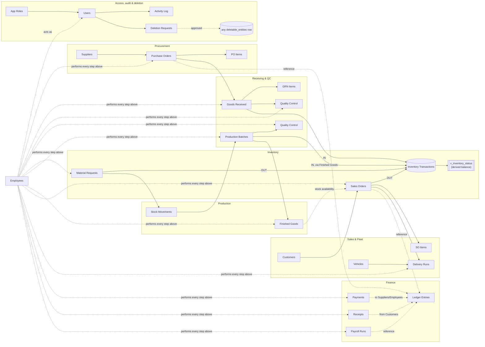

# Relationship Diagram

Two views of "how things relate": the **business-process flow** data moves
through, and the **complete FK inventory** underneath it (every real foreign
key plus every trigger-enforced polymorphic one — see `docs/ERD.md` for the
entity-attribute view of the same relationships).

## Process flow

This is the same chain the original SQLite schema's seed script drove
end-to-end: **Procurement → Receiving → QC → Inventory**, and separately
**Material Requests → Production → Packaging → Inventory → Sales → Fleet →
Finance**, with **Employees/Users/Roles** and **Activity Log/Deletion
Requests** cutting across every module as the actor and audit layer.

## Complete relationship inventory

Every arrow in the ERD, as a table. "Real FK" relationships are enforced by
a `REFERENCES` constraint; "Trigger" relationships are the polymorphic ones
enforced by the function named, since Postgres cannot express a conditional
foreign key.

| From | To | Cardinality | Enforcement | On delete |
|---|---|---|---|---|
| employees.department_id | departments.id | N:1 | Real FK | RESTRICT (default) |
| employees.job_title_id | job_titles.id | N:1 | Real FK | RESTRICT |
| users.employee_id | employees.id | 1:0..1 | Real FK, UNIQUE | RESTRICT |
| users.role_id | app_roles.id | N:1 | Real FK | RESTRICT |
| role_page_access.role_id | app_roles.id | N:1 | Real FK | CASCADE |
| role_page_access.page_key | pages.page_key | N:1 | Real FK | CASCADE |
| user_page_access.user_id | users.id | N:1 | Real FK | CASCADE |
| user_page_access.page_key | pages.page_key | N:1 | Real FK | CASCADE |
| items.category_id | item_categories.id | N:1 | Real FK | RESTRICT |
| items.uom_code | uoms.code | N:1 | Real FK | RESTRICT |
| suppliers.location_id | locations.id | N:1 | Real FK | RESTRICT |
| customers.location_id | locations.id | N:1 | Real FK | RESTRICT |
| vehicles.default_driver_employee_id | employees.id | N:1 | Real FK | RESTRICT |
| assets.location_id | warehouse_locations.id | N:1 | Real FK | RESTRICT |
| settings.updated_by_employee_id | employees.id | N:1 | Real FK | RESTRICT |
| water_treatment_runs.source_id | water_sources.id | N:1 | Real FK | RESTRICT |
| water_treatment_runs.stage_id | treatment_stages.id | N:1 | Real FK | RESTRICT |
| water_treatment_runs.operator_employee_id | employees.id | N:1 | Real FK | RESTRICT |
| purchase_orders.supplier_id | suppliers.id | N:1 | Real FK | RESTRICT |
| purchase_orders.requested_by_employee_id | employees.id | N:1 | Real FK | RESTRICT |
| purchase_order_items.po_id | purchase_orders.id | N:1 | Real FK | CASCADE |
| purchase_order_items.item_id | items.id | N:1 | Real FK | RESTRICT |
| goods_received.po_id | purchase_orders.id | N:1 | Real FK | RESTRICT |
| goods_received.received_by_employee_id | employees.id | N:1 | Real FK | RESTRICT |
| goods_received_items.grn_id | goods_received.id | N:1 | Real FK | CASCADE |
| goods_received_items.item_id | items.id | N:1 | Real FK | RESTRICT |
| quality_control.ref_id → goods_received.id **or** production_batches.id | 1:N (by ref_type) | **Trigger**: `fn_quality_control_validate_ref` | n/a |
| quality_control.inspector_employee_id | employees.id | N:1 | Real FK | RESTRICT |
| inventory_transactions.item_id | items.id | N:1 | Real FK | RESTRICT |
| inventory_transactions.actor_employee_id | employees.id | N:1 | Real FK | RESTRICT |
| inventory_transactions.source_id → purchase_orders / production_batches / sales_orders / material_requests | 1:N (by source_type) | **Trigger**: `fn_inventory_validate_source` | n/a |
| warehouse_requisitions.item_id | items.id | N:1 | Real FK | RESTRICT |
| warehouse_requisitions.department_id | departments.id | N:1 | Real FK | RESTRICT |
| warehouse_requisitions.requested_by_employee_id | employees.id | N:1 | Real FK | RESTRICT |
| material_requests.requested_by_employee_id | employees.id | N:1 | Real FK | RESTRICT |
| material_requests.department_id | departments.id | N:1 | Real FK | RESTRICT |
| material_request_items.request_id | material_requests.id | N:1 | Real FK | CASCADE |
| material_request_items.item_id | items.id | N:1 | Real FK | RESTRICT |
| stock_movements.request_id | material_requests.id | N:0..1 | Real FK | RESTRICT |
| stock_movements.item_id | items.id | N:1 | Real FK | RESTRICT |
| stock_movements.from_location_id / to_location_id | warehouse_locations.id | N:1 (×2) | Real FK | RESTRICT |
| stock_movements.moved_by_employee_id | employees.id | N:1 | Real FK | RESTRICT |
| production_batches.product_item_id | items.id | N:1 | Real FK | RESTRICT |
| production_batches.line_id | production_lines.id | N:1 | Real FK | RESTRICT |
| production_batches.shift_id | shifts.id | N:1 | Real FK | RESTRICT |
| production_batches.operator_employee_id | employees.id | N:1 | Real FK | RESTRICT |
| production_batches.water_treatment_run_id | water_treatment_runs.id | N:0..1 | Real FK | RESTRICT |
| finished_goods.batch_id | production_batches.id | N:1 | Real FK | RESTRICT |
| finished_goods.item_id | items.id | N:1 | Real FK | RESTRICT |
| finished_goods.packaged_by_employee_id | employees.id | N:1 | Real FK | RESTRICT |
| sales_orders.customer_id | customers.id | N:1 | Real FK | RESTRICT |
| sales_orders.rep_employee_id | employees.id | N:1 | Real FK | RESTRICT |
| sales_order_items.sales_order_id | sales_orders.id | N:1 | Real FK | CASCADE |
| sales_order_items.item_id | items.id | N:1 | Real FK | RESTRICT |
| delivery_runs.sales_order_id | sales_orders.id | N:1 | Real FK | RESTRICT |
| delivery_runs.vehicle_id | vehicles.id | N:1 | Real FK | RESTRICT |
| delivery_runs.driver_employee_id | employees.id | N:1 | Real FK | RESTRICT |
| ledger_entries.account_id | chart_of_accounts.id | N:1 | Real FK | RESTRICT |
| ledger_entries.reference_id → purchase_orders / sales_orders / payroll_runs / goods_received | 1:N (by reference_type) | **Trigger**: `fn_finance_validate_reference` | n/a |
| payments.reference_id / receipts.reference_id | same targets as above | 1:N (by reference_type) | **Trigger**: `fn_finance_validate_reference` | n/a |
| payments.counterparty_id / receipts.counterparty_id → suppliers / customers / employees | 1:N (by counterparty_type) | **Trigger**: `fn_finance_validate_counterparty` | n/a |
| payroll_runs.employee_id | employees.id | N:1 | Real FK, UNIQUE with period_month | RESTRICT |
| reports.owner_employee_id | employees.id | N:1 | Real FK | RESTRICT |
| activity_log.actor_user_id | users.id | N:1 | Real FK | RESTRICT |
| deletion_requests.entity_type | deletable_entities.entity_type | N:1 | Real FK | RESTRICT |
| deletion_requests.entity_id → *(table named by deletable_entities.table_name)* | 1:N (dynamic) | **Trigger**: `fn_deletion_requests_apply` (applies the soft-delete; does not validate existence beforehand — the requester supplies a real id from the target table by construction) | n/a |
| deletion_requests.requested_by_user_id / reviewed_by_user_id | users.id | N:1 (×2) | Real FK | RESTRICT |

All 40 real foreign keys default to `ON DELETE RESTRICT` (Postgres's
implicit default — no `ON DELETE` clause was written) **except** the
parent/child line-item pairs (`purchase_order_items`, `goods_received_items`,
`material_request_items`, `sales_order_items`) and the two access-grant
junction tables (`role_page_access`, `user_page_access`), which `CASCADE` —
deleting a header row or a role/user/page should take its lines/grants with
it. Every master/document table participating in the deletion-approval
workflow (`items`, `suppliers`, `customers`, `employees`, `users`,
`vehicles`, `assets`, `purchase_orders`, `material_requests`,
`warehouse_requisitions`, `sales_orders`) is never actually `DELETE`d by the
application in the first place — see `deletion_requests` above — so
`RESTRICT` there is a backstop, not the primary safeguard.
